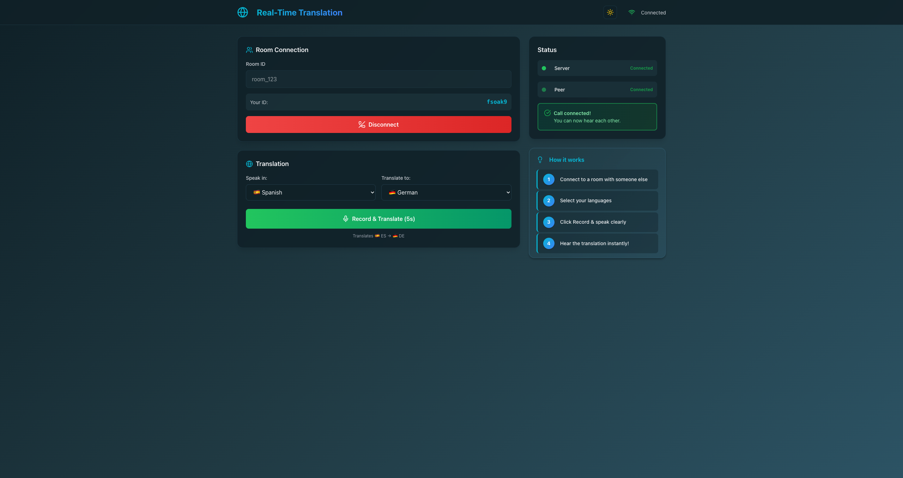
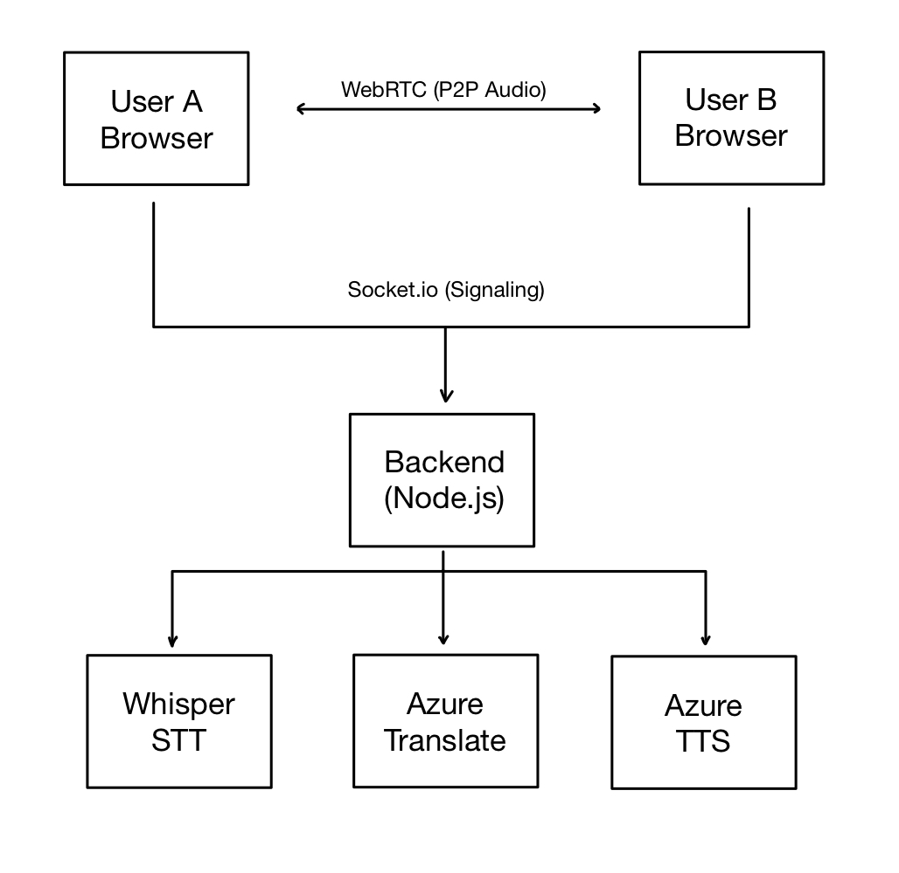

# 🌍 Real-Time Translation

> Break language barriers with AI-powered real-time voice translation

[](https://realtime-translation-gules.vercel.app)
[](LICENSE)
[](https://www.typescriptlang.org/)
[](https://nextjs.org/)

A WebRTC-based real-time audio translation application that enables seamless voice communication across language barriers. Connect with anyone, speak in your language, and let AI handle the translation instantly.


## ✨ Features

- 🎙️ **Real-Time P2P Voice** - Low-latency peer-to-peer communication via WebRTC
- 🌐 **Multi-Language Support** - Estonian, English, Spanish, German
- 🤖 **AI-Powered Pipeline** - Whisper STT → Azure Translator → Azure Neural TTS
- 🎨 **Beautiful UI** - Modern design with light/dark mode
- 📱 **Responsive** - Works seamlessly on desktop and mobile
- 🔒 **Secure** - Direct peer-to-peer connection, no audio stored on servers

## 🎬 Demo

**Live Application:** [realtime-translation.vercel.app](https://realtime-translation-gules.vercel.app)

### Desktop Views

<table>
  <tr>
    <td></td>
    <td></td>
  </tr>
  <tr>
    <td align="center"><b>Light Mode</b></td>
    <td align="center"><b>Dark Mode</b></td>
  </tr>
</table>

### 📱 Mobile Views

<table>
  <tr>
    <td align="center">
      
    </td>
    <td align="center">
      
    </td>
  </tr>
  <tr>
    <td align="center"><b>Dark Mode</b></td>
    <td align="center"><b>Light Mode</b></td>
  </tr>
</table>

## 🚀 Quick Start

### Prerequisites

- Node.js 18+ 
- FFmpeg installed ([Download here](https://ffmpeg.org/download.html))
- API Keys:
  - [OpenAI API Key](https://platform.openai.com/api-keys)
  - [Azure Speech Services](https://azure.microsoft.com/en-us/services/cognitive-services/speech-services/)
  - [Azure Translator](https://azure.microsoft.com/en-us/services/cognitive-services/translator/)

### Installation

1. **Clone the repository**
```bash
git clone https://github.com/ChrisRobinT/realtime-translation.git
cd realtime-translation
```

2. **Setup Backend**
```bash
cd backend
npm install
cp .env.example .env
# Add your API keys to .env
node server.js
```

3. **Setup Frontend**
```bash
cd frontend
npm install
npm run dev
```

4. **Visit** `http://localhost:3000`

## 🔑 Environment Variables

Create `backend/.env` with:
```env
# OpenAI API
OPENAI_API_KEY=sk-your-openai-key

# Azure Speech Services
AZURE_SPEECH_KEY=your-azure-speech-key
AZURE_SPEECH_REGION=your-region

# Azure Translator
AZURE_TRANSLATE_KEY=your-azure-translator-key
AZURE_TRANSLATE_REGION=your-region

# Server Port (optional)
PORT=3001
```

## 🏗️ Architecture



### How It Works

1. **Connect** - Two users join the same room ID
2. **P2P Voice** - Real-time audio streaming via WebRTC
3. **Record** - User presses button to record 5 seconds
4. **Transcribe** - Audio sent to OpenAI Whisper for speech-to-text
5. **Translate** - Text translated via Azure Translator
6. **Synthesize** - Translation converted to speech with Azure Neural TTS
7. **Play** - Translated audio plays automatically

## 🛠️ Tech Stack

### Frontend
- **Framework:** Next.js 16 with TypeScript
- **Styling:** Tailwind CSS v4
- **Real-time:** Socket.io Client
- **WebRTC:** Simple-Peer
- **Icons:** Lucide React

### Backend
- **Runtime:** Node.js
- **Framework:** Express
- **Signaling:** Socket.io
- **STT:** OpenAI Whisper
- **Translation:** Azure Translator
- **TTS:** Azure Neural TTS
- **Audio Processing:** FFmpeg

### Infrastructure
- **Frontend Hosting:** Vercel
- **Backend Hosting:** Railway
- **WebRTC:** Direct P2P connection

## 📂 Project Structure
```
realtime-translation/
├── frontend/                # Next.js frontend
│   ├── app/
│   │   ├── page.tsx        # Main app component
│   │   ├── layout.tsx      # Root layout
│   │   └── globals.css     # Global styles
│   ├── public/
│   └── package.json
│
├── backend/                 # Node.js backend
│   ├── server.js           # Express server + Socket.io
│   ├── translationService.js  # AI pipeline
│   ├── .env.example        # Environment template
│   └── package.json
│
└── README.md
```

## 🎯 Usage

### For Users

1. **Open the app:** [realtime-translation.vercel.app](https://realtime-translation-gules.vercel.app)
2. **Create/Join Room:** Enter a room ID (e.g., "123")
3. **Share Room ID:** Give the same room ID to another person
4. **Connect:** Click "Connect to Room"
5. **Talk & Translate:**
   - Speak normally for real-time P2P voice
   - Click "Record & Translate" to translate speech
   - Hear the translation in your chosen language!

### Supported Languages

| Language | Code | Voice |
|----------|------|-------|
| 🇪🇪 Estonian | `et` | Anu (Female) |
| 🇬🇧 English | `en` | Jenny (Female) |
| 🇪🇸 Spanish | `es` | Elvira (Female) |
| 🇩🇪 German | `de` | Katja (Female) |

## 🚧 Roadmap

- [ ] Continuous translation mode (no button press)
- [ ] Support for 20+ languages
- [ ] Text chat alongside voice
- [ ] Recording history
- [ ] User authentication
- [ ] Room persistence
- [ ] Mobile app (React Native)
- [ ] Voice activity detection (VAD)
- [ ] Multi-party calls (3+ users)

## 🤝 Contributing

Contributions are welcome! Here's how you can help:

1. Fork the repository
2. Create a feature branch (`git checkout -b feature/AmazingFeature`)
3. Commit your changes (`git commit -m 'Add some AmazingFeature'`)
4. Push to the branch (`git push origin feature/AmazingFeature`)
5. Open a Pull Request

### Development Guidelines

- Write clean, documented code
- Follow TypeScript best practices
- Test thoroughly before submitting PR
- Update README if adding features

## 📝 License

This project is licensed under the MIT License - see the [LICENSE](LICENSE) file for details.

## 🙏 Acknowledgments

- [OpenAI Whisper](https://openai.com/research/whisper) - Speech-to-text
- [Azure Cognitive Services](https://azure.microsoft.com/en-us/services/cognitive-services/) - Translation & TTS
- [Simple-Peer](https://github.com/feross/simple-peer) - WebRTC abstraction
- [Next.js](https://nextjs.org/) - React framework
- [Socket.io](https://socket.io/) - Real-time communication

## 👨‍💻 Author

**Chris-Robin Talts**

- GitHub: [@ChrisRobinT](https://github.com/ChrisRobinT)
- LinkedIn: [chrisrobintalts](https://linkedin.com/in/chrisrobintalts)
- Email: chrisrobin.talts@gmail.com

## 🐛 Known Issues

- Translation works best with clear audio and minimal background noise
- 5-second recording limit (by design)
- Requires stable internet connection for translation API calls

## 💡 FAQ

**Q: Is the audio stored anywhere?**  
A: No! Voice calls are peer-to-peer. Only the 5-second recordings for translation are temporarily sent to our server and immediately deleted.

**Q: Why do I need a room ID?**  
A: Room IDs ensure you connect to the right person. Think of it like a phone number.

**Q: Can I use this for professional translation?**  
A: While the AI is highly accurate, we recommend professional human translators for critical content.

**Q: Is it free?**  
A: The demo is free! However, running your own instance requires API keys which have costs.

---

<div align="center">

**Built with ❤️ to break language barriers**

[⬆ Back to Top](#-real-time-translation)

</div>
